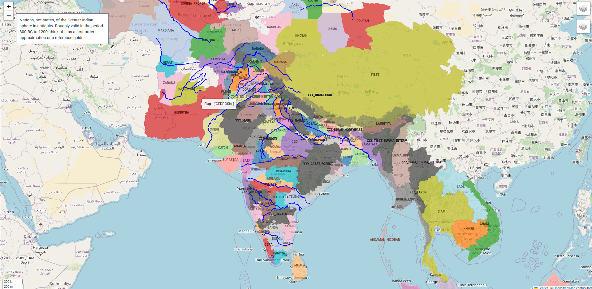
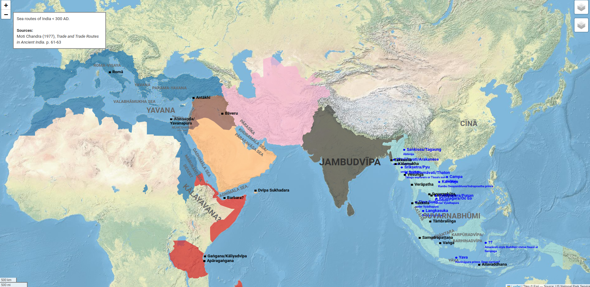

* [srajma.github.io/xatra](https://srajma.github.io/xatra) — `xatra`, a Python package I wrote for making historical maps.
* [srajma.github.io/writing/history](https://srajma.github.io/writing/history) — my drafts/notes on Indian history
* [srajma.github.io/book](https://srajma.github.io/book) — _The Great Empire_, a fictionalized account of Kautilya's rise to power
* [srajma.github.io/x](https://srajma.github.io/writing/x) — redirect to the best twitter threads of NiṣādaHermaphroditarchaṃśa (Mal'ta boy ka parivar) [ `@real_mahalingam`]
* [srajma.github.io/blog](https://srajma.github.io/blog) — redirect to my substack

## xatra

Check out [srajma.github.io/xatra](https://srajma.github.io/xatra) or some example maps such as [INDOSPHERE.html](https://srajma.github.io/xatra/examples/nations/INDOSPHERE.html) or [SEA_ROUTES.html](https://srajma.github.io/xatra/examples/colonies/SEA_ROUTES.html).

# History articles

Docs will be posted on my [substack](https://srajma.github.io/blog/) when complete, and probably [X](https://x.com/real_mahalingam) and Reddit.

🏜️ (not started) | 🏗️ (work-in-progress) | ❗ (current project) | 📤 (waiting to post) | ✅ (all done)

1. [3 pitfalls to avoid in reading Indian history](writing/history/pitfalls.md) 📤
2. [Features and contradictions of premodern Indian civilization](writing/history/features.md) 🏗️
3. Sources/secondary: [A short bibiliography of good sources for Indian history](writing/history/sources/secondary.md) ✅
4. Sources/primary: [A catalog of ancient Indian literary sources](writing/history/sources/primary.md) 🏗️
6. Hinduism/philosophy: [The early development of Indian philosophy](writing/history/hinduism/philosophy.md) 🏗️
7. Hinduism/theology: [Early Vedic society and theological developments](writing/history/hinduism/theology.md) 🏗️
8. Foreign/west: [Axial age Indian influences on the Western realms](writing/history/foreign/axial) 🏗️
9. Foreign/silkrd: [The Sanskritization of the Overland and Maritime Silk Roads](writing/history/foreign/silkrd) 🏗️
10. Foreign/accounts: [Foreign accounts of India](writing/history/foreign/accounts) 🏜️
11. Ancient Indian discoveries and inventions 🏜️
12. Myths/intro: [Indian history myths, narratives and overcorrections](writing/history/myths/intro) 🏗️
13. Myths/barbarians: [Notes on barbarians](writing/history/myths/barbarians) 🏗️
14. Myths/civilization: Brāhmī, water-wheels, coins, Pythagoras 🏗️
15. Myths/dating: Kautilya, Gustav Oppert gunpowder, Ayodhya, Ramayana/MBh 🏗️
16. Myths/culture: Notes on a defense of Indian culture: caste, Buddhism, Ayurveda, diet, general morals 🏗️

**Old writing not fully endorsed**
1. [A political history of premodern India](writing/history/old/political_history)
2. [Note on Vikramāditya](writing/history/old/vikramaditya)
3. [Some maps to visualize India in antiquity](writing/history/old/maps)
4. [Estimating Mauryan-era incomes from the weight of a mung bean](writing/history/old/income)

# The Great Empire
Read here: [https://srajma.github.io/book/](https://srajma.github.io/book/)
- [0.1 INTRODUCTION](https://srajma.github.io/book/chapters/0/0.1)
- [0.2 PROLOGUE: Pratiṣṭhāna Kāṇḍa](https://srajma.github.io/book/chapters/0/0.2)
- 1 Takṣaśila Kāṇḍa (*The Taxila Chapter*). In a world where the Vedic light appears to be dying, crushed from both sides by the Magadhas and the Persians, a young Cāṇakya resolves to make some changes.
	- [1.1 Neti Kautilyaḥ! (“No, says Kautilya”)](https://srajma.github.io/book/chapters/1/1.1)
	- [1.2 Of picking one’s battles](https://srajma.github.io/book/chapters/1/1.2)
	- [1.3 The enemy of my enemy](https://srajma.github.io/book/chapters/1/1.3)
	- [1.4 Deception games](https://srajma.github.io/book/chapters/1/1.4)
	- [1.5 The art of manipulation](https://srajma.github.io/book/chapters/1/1.5)
	- [1.6 Clandestine operations](https://srajma.github.io/book/chapters/1/1.6)
	- [1.7 The art of double crossing](https://srajma.github.io/book/chapters/1/1.7)
	- [1.8 Mundia and modia](https://srajma.github.io/book/chapters/1/1.8)
	- [1.9 Reductionism](https://srajma.github.io/book/chapters/1/1.9)
	- [1.10 Hero worship](https://srajma.github.io/book/chapters/1/1.10)
	- [1.11 Availing opportunities](https://srajma.github.io/book/chapters/1/1.11)
- 2 Mathura Kāṇḍa (*The Mathura Chapter*). Cāṇakya makes contact the mysterious Order of Saṅkarṣaṇa, and seeks to be titled as their chosen hero. But for that he must first rise as a statesman, plotting, with his new aides, some of his first schemes to manipulate the great empires of his day.
	- [2.1 Motivated questionnaire](https://srajma.github.io/book/chapters/2/2.1)
	- [2.2 Pavel Morozov](https://srajma.github.io/book/chapters/2/2.2)
	- [2.3 Work experience](https://srajma.github.io/book/chapters/2/2.3)
	- [2.4 The Manhattan Project](https://srajma.github.io/book/chapters/2/2.4)
	- [2.5 Cutting the Gordian knot](https://srajma.github.io/book/chapters/2/2.5)
- 3 Yavana Kāṇḍa (*The Hellenic Chapter*). A new player appears on the scene, an ambitious conqueror from a distant land called Macedon. But Cāṇakya intends to turn this into an opportunity, and ensure that the fruits of the newcomer’s efforts will be solely reaped by Candragupta.
	- [3.1 Signalling networks](https://srajma.github.io/book/chapters/3/3.1)
	- [3.2 Learning to lose](https://srajma.github.io/book/chapters/3/3.2)
	- [3.3 Fake rebelliousness](https://srajma.github.io/book/chapters/3/3.3)
	- [3.4 Coalitions](https://srajma.github.io/book/chapters/3/3.4)
	- [3.5 The (in)validity of feelings](https://srajma.github.io/book/chapters/3/3.5)
	- [3.6 Image consciousness](https://srajma.github.io/book/chapters/3/3.6)
	- [3.7 Synecdoche](https://srajma.github.io/book/chapters/3/3.7)
	- [3.8 Speaking ill of the dead](https://srajma.github.io/book/chapters/3/3.8)
	- [3.9 Showing empathy](https://srajma.github.io/book/chapters/3/3.9)
	- [3.10 Hell](https://srajma.github.io/book/chapters/3/3.10)
	- [3.11 Gifting knives](https://srajma.github.io/book/chapters/3/3.11)
	- [3.12 Linus’s law](https://srajma.github.io/book/chapters/3/3.12)
- 4 Āryāvarta Kāṇḍa (*The Central Country Chapter*). Instead of enjoying his well-fought win, Cāṇakya decides to stake it all in the most unhinged gamble any man had ever took. Will he extract the nectar of victory from the sea of tumult?
	- [4.1 Putting in the effort](https://srajma.github.io/book/chapters/4/4.1)
	- [4.2 Repugnant alliances](https://srajma.github.io/book/chapters/4/4.2)
	- …
- 5 Magadha Kāṇḍa (*The Magadha Chapter*). Yes. He did.
	- …
- 6 Dakṣiṇapatha Kāṇḍa (*The Deccan Chapter*). But the celebrations are short-lived.
	- …
- 7 Uttara Kāṇḍa (*Epilogue*). Faced with his own eventual mortality, Cāṇakya decides to have as many children as possible, so each generation may have at least one of him. But what if the world was faced with a man who possessed all of Cāṇakya’s qualities, except moral direction?
	- …
- Supplements
	- Vāsudeva
		- [1.1_catapult](https://srajma.github.io/book/chapters/vasudeva/1.1_catapult)
		- [1.2_rebels](https://srajma.github.io/book/chapters/vasudeva/1.2_rebels)
		- [1.3_coup](https://srajma.github.io/book/chapters/vasudeva/1.3_coup)
		- [1.4_coronation](https://srajma.github.io/book/chapters/vasudeva/1.4_coronation)
		- [1.5_birth](https://srajma.github.io/book/chapters/vasudeva/1.5_birth)
		- [2.1_childhood](https://srajma.github.io/book/chapters/vasudeva/2.1_childhood)
		- [2.2_licchavi](https://srajma.github.io/book/chapters/vasudeva/2.2_licchavi)
		- [2.3_mother](https://srajma.github.io/book/chapters/vasudeva/2.3_mother)
		- [2.4_father](https://srajma.github.io/book/chapters/vasudeva/2.4_father)
		- [2.5_wife](https://srajma.github.io/book/chapters/vasudeva/2.5_wife)
		- [2.6_letter](https://srajma.github.io/book/chapters/vasudeva/2.6_letter)
		- [2.7_ayodhya_1](https://srajma.github.io/book/chapters/vasudeva/2.7_ayodhya_1)
		- [2.7_ayodhya_2](https://srajma.github.io/book/chapters/vasudeva/2.7_ayodhya_2)
		- [2.8_death](https://srajma.github.io/book/chapters/vasudeva/2.8_death)
	- [Dāśarājña](https://srajma.github.io/book/chapters/dasarajna)
	- The Men who Built India
	- The Great Indian Civil War
	- Delhi 1200 BC
	- Age of Iron
	- The Man who Built Civilization
- Special
	- quotes
		- [arthashastra](https://srajma.github.io/book/chapters/specials/quotes/arthashastra/index)
		- [canakya_niti](https://srajma.github.io/book/chapters/specials/quotes/canakya_niti/index)
		- [greek](https://srajma.github.io/book/chapters/specials/quotes/greek/index)
		- [misc](https://srajma.github.io/book/chapters/specials/quotes/misc/index)
		- [full_page_vizhdam](https://srajma.github.io/book/chapters/specials/quotes/full_page_vizhdam) (quotes from Baba NiṣādaHermaphroditarchyaṃśa aka Baba Srajma, not any primary source)
		- [quotable](https://srajma.github.io/book/chapters/specials/quotes/quotable) (quotes from Baba NiṣādaHermaphroditarchyaṃśa aka Baba Srajma, not any primary source)
	- … (more, navigate through the folders to find as it’s too much to maintain)

# Tips, tools and links 

* Useful symbols: – — ― 卐 卍
* [IAST transliteration tool](https://www.yesvedanta.com/transliterate/), [Convertcase](https://convertcase.net/)
* [Mapchart](https://www.mapchart.net/)
* Stable Diffusion: Just use their API via their colab notebooks: [homepage](https://platform.stability.ai/pricing), [direct notebook link](https://colab.research.google.com/github/stability-ai/stability-sdk/blob/main/nbs/Stable_Image_API_Public.ipynb). Other tips: [[1]](https://www.reddit.com/r/StableDiffusion/comments/13bvbps/ive_created_200_sd_images_of_a_consistent/), [[2]](https://stable-diffusion-art.com/beginners-guide/), [[3]](https://mythicalai.substack.com/p/how-to-create-consistent-characters), [[4]](https://www.reddit.com/r/StableDiffusion/comments/16xfv6z/dalles_ability_to_adhere_to_prompts_great_img2img/) -- ComfyUI (see [tutorial](https://www.youtube.com/watch?v=gHI6PjTkBF4)) seems great too
* Vishvas Vasuki: [website](https://vishvasa.github.io/), [gotra haplogroup proj](https://github.com/sanskrit/gotra-haplogroup/tree/master), [mānasataraṅginī dictionary](https://github.com/indic-dict/stardict-sanskrit/blob/master/sa-head/en-entries/MT-paribhAShA/MT-paribhAShA.babylon)
* [yfull.com](https://yfull.com)
* Indian units [[1]](https://www.sanskritimagazine.com/ancient-indian-units-system-of-length-measurement/) [[2]](https://indiadatagraphics.wordpress.com/2021/06/09/ancient-indian-units-and-measures/), [Sanskrit names](https://www.fantasynamegenerators.com/sanskrit-names.php), [Persian names](https://www.behindthename.com/submit/names/usage/ancient-persian)
