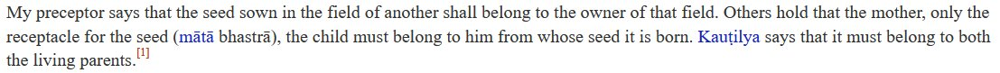

Hot take: when it comes to making another religion's conservatism look bad, Indian RWs should learn from the undisputed masters of propaganda: Western libs. 

Libs have been incredibly successful in making Western conservatives look like incels (even when most are not)--

https://x.com/Zoomerjeet/status/1793144844325687755

Nobody understands aesthetics as well as libs do.

This is the movie Olivia Wilde made specifically to shit on Jordan Peterson.

Abhorrent shitlib bullying, but it gets its job done: makes men seeking a traditional 1950s wife look like pathetic losers who are also r\*pists.

The Kerala Story should have been a literal remake of this movie: a medieval Islamic palace & zenana in a desert, turns out to be a project of Muslim incels world over who drugged their gfs/cousins, bankrolled by a Qatari prince. The men leave for "jihad" (cab driving) every day.

Libs don't cv\*kpost about how conservatives are "taking their women"

They just make traditional American conservative relationships -- both the men and the women in them -- look low-status.

And this is *important* even beyond childish "I f\*cked your mom/planted my bhagwa" bs--

Because this was their primary weapon in turning all the status-conscious elites liberal.

Also OT but the use of the "kheti" quote as an own is embarrassing, because it demonstrates never having engaged with your own religion. The kheti analogy is very common in Hindu literature. E.g. Kautilya:

