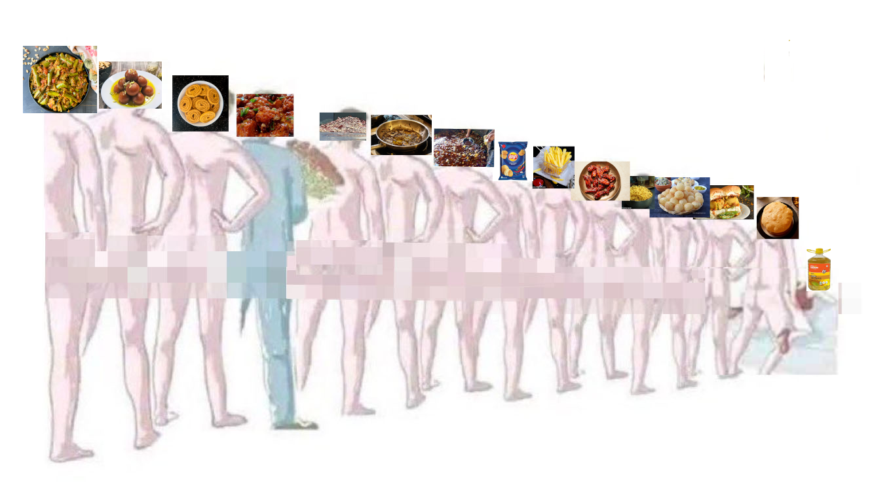

https://x.com/TheEmissaryCo/status/1866151047493734706

Trads & shernis, raitas & xoomers, Brahmanical patriarchs & sanatani Chineses, it is with great pleasure that I announce, in time for your resolutions for the sanatani-christian new year:

***THE OFFICIAL DIET FOR THE NEW ĀRYA MAN.***

(anyone does not follow this to the letter, and anyone who does not instantly hit retweet, is condemned to mleccha status effective immediately. not joking.)

As with all other things, health/diet discourse on HX is low-signal slop dominated by useless truth-agnostic agenda-peddlers (“India bad“ “India good“ “dad bad” “son bad”), insecure bhōsaḍpillers who want to blame their poor choices on either 3000, 200, 19 or 10 years of oppression depending on their political persuasion, and halfwits who got jio yesterday and formed all their opinions based on the first crackpot blog they found.

If you want to drain the slop and become HIGH-SIGNAL ELITE HVMAN CAPITAL, you must forget everything you think you know and just listen to me. Again, as with all other things.

**A. The goals of health are four-fold:**
Avoiding heart disease and cancer
Avoiding micronutrient deficiencies
Building a powerhouse of a brain and body
Building capacity for mass-REPRODVCTION (high T for men, industrial-standard menstrual cycle for women)

minor goals: avoiding kidney and liver failure, spine knees and bones of rearden metal, a powerful neck and jaw, immunity, good teeth eyes skin hair, flexibility

**B. The method to achieve these goals is four-fold:**
Eat according to this guide.
Exercise — VO2 max training ~2-4 days/wk, lift 4-5 days/wk, at least light cardio everyday.
<12\% bodyfat for men, 20% for women.
Sleep at a consistent time and get sunlight upon waking.

Take a moment to appreciate how *surprising and fortunate* it is that this is all you need to do, to achieve all four goals of health — that there are almost *no trade-offs* between the goals of health; the things you must do are the same for all. What is good for your brain is what is good for your heart is what is good for building muscle. I can count the exceptions on my fingers. You have nothing to lose but your vaḍāpāv.

This guide focuses on diet, but exercise > diet. VO2-max is the single greatest predictor of life expectancy, and is best trained by HIIT (google it). Unless you’re fat, then diet matters more until you lose it.

other helpful things:
chugging water (your machine needs coolant, plus your kidneys demand it)
get an air purifier if you live in the karmabhūmī (but Kerala exceptionalism strikes again)
use a standing desk if you can, and exercise whenever you feel like taking a break while working

**C. The main contents of your diet >> “preservatives”**

Look, I get that you’re mad about the state of the food supply chain. Adulteration, microplastics, Annadātās’ special pesticides, random additives, soils with heavy metal content — and yeah, I mean, it sucks, it should be fixed.

But—with the exception of some serious cases like turmeric adulteration—the effect of all of this is *marginal* compared to what is in your own hands: the actual foods you choose to eat.

If you’re eating deep-fried foods, sugar, refined grains — you have forfeited your right to complain about FSSAI, packaging, and all such relative trivialities. If you’re eating at restaurants, or drinking alcohol, you deserve all the adulteration you get.

Improving your overall diet, to have correct macro ratios, correct fruits and vegetables and nuts and spices, eliminating junk, will be infinitely more valuable than avoiding “preservatives”.

**D. Things that are ALWAYS bad for you.**
Any food at or ordered from a restaurant. Full of gutter oil.`**`
Processed meats.
Deep-fried foods.
Drugs, including alcohol and smoking.
Trans-fats.
Red meats.
Refined grains: white rice, maida, many flours and ravās`***`.
Sugar (yes, jaggery, honey and syrups are sugar).
Saturated fats: ghee, coconut oil`*`

`*` “Oh but SeedOilDestroyer429 told me saturated fats are *good*!” No, shut up. Saturated fats causing heart disease and raising LDL is the single most replicated finding in all of nutrition. 

Bullshit artists will make stupid Nehru-vs-Ambedkar comparisons like “it’s the CARBS that are bad for you, not saturated fats” — I don’t care, both are bad. I didn’t ask for a comparison. 

“But seed oils are evil, they’re inflammatory!” — I didn’t tell you to eat seed oils. I’ll tell you what to eat when I feel like it. Keep reading, doublechin.

Use the coconut oil for your hair and the ghee for your diyās. 

`**` Yes, even at your “reputed restaurant”, and even if you’re not ordering something deep-fried. The oil you’re eating will (1) have been deep-fried in multiple times and become carcinogenic (2) include grease from sources like fryers, kitchen waste, slaughterhouse waste and sewer drains.

Yes sār, even the oil in your vegetarian restaurant is filled with grease from slaughterhouses. 

Eating out literally means getting cvcked (by all the dudes who tasted that oil before you).

`***` You can find out by looking at the protein and fibre content in the nutritional info. Whole wheat (dry) is 13% protein and 10% fibre by weight; similarly brown rice is 8% protein and 5% fibre by weight. Anything less is circumcised. 

Healthier alternatives for each of these:

**Saturated fats → monounsaturated fats (avocado/olive/mustard oil).** If you like the taste of ghee, try shallow-frying some milk powder in some avocado oil.
**Sugar → stevia, allulose, monk fruit.** Make sure to check it’s pure stevia extract — it will be a very tiny quantity, either powder or drops, because it’s like 100x sweeter than sugar. But even artificial sweeteners like sucralose are better  than sugar.
**Refined grains → Legumes, whole grains, root vegetables.**
**Deep-fried foods → Air-frying.**
**Drugs → Rat poison.** (this is a joke, don’t sue me if you kill yourself)
**Eating out → Learn how to cook, you overgrown child.**

The fundamental reason why eating out, or eating ultra-processed foods is *always* unhealthy, is that optimizing really well in an even slightly imperfect direction leads to inevitable disaster. Markets are really good at optimization, but they optimize for what consumers can transparently see (e.g. taste, color). They will sacrifice enormous amounts of “healthiness” to squeeze out even the slightest gains in taste, because the consumer cannot observe or verify “healthiness” and so it doesn’t affect his decision to buy.

**E. Eating healthy is easy.**

“How can you tell me to quit eating out *entirely* sār, my hostel doesn’t have a kitchen sār, I need to eat sweets at least occasionally sār”

1— **Gaining (or even maintaining) weight while eating healthy takes real *effort***. If this seems surprising to you, you have the wrong idea of what “eating healthy” means.

2— Once you quit, **you will naturally stop craving for junk** after a few months, because the gut bacteria that were craving for it will get replaced by strains that crave for The New Ārya Man’s diet.

3— Cooking is extremely easy. Foids have kept this secret from you to make you think their job is irreplaceable. There’s a lot of stuff you can cook easily without any heat/kitchen (keep reading).

**F. Macro ratios.**

Diagram shows the macronutrients, i.e. the bulk of your food, which you can see and feel — and the % of your daily calories each should account for [1].

For a 3000 calorie diet, these ratios amount to:
300g carbs
150g protein
120g fat, of which:
- less than 20g SFA
- 60g MUFA
- 20g ω-3, 20g ω-6

(In all likelihood you will end up eating more ω-6 than this and less MUFAs. It’s fine, just don’t get your ω-3 : ω-6 ratio below 1:2 at least.)

The key thing to understand about PUFAs is that ω-6 (“seed oil”) isn’t *bad* per se — it’s just that (1) they are unstable when heated, which means you should get them from nuts and seeds rather than adding them to cooking, and (2) the ω-3 : ω-6 ratio should be as close to 1:1 as possible. This is hard! Most people’s ratio is close to something like 1:20. Eat more ω-3 and less ω-6.

All the purported benefits of SFA for testosterone are also found in MUFAs [2], but without the downside of dying from heart disease.

**G. Food groups.**

Ok, so where do you actually get these from? 

- Legumes — 80% carbs, 20% protein
- Whole grains — 90% carbs
- Starchy vegetables — carbs
- Fruits — mostly fibre and water with some sugar.
- Vegetables — fibre and water.
- Nuts and seeds and their oils — 80% fat. Most nuts are a combo of ω-6 and MUFA; only chia and flax are rich in ω-3.
- Other oils — avocado, olives are MUFA, coconut is SFA.
- Dairy — 50% fat (SFA), 25% protein, 25% sugar. So use low-fat milk.
- Eggs — 67% fat (blend of all SFA/MUFA/PUFA), 33% protein.
- Fish — protein and fat (ω-3)
- Meat — protein and fat (SFA)

Bookmark this wikipedia table: https://en.wikipedia.org/wiki/Template:Types_of_cooking_oils_and_fats to get an idea of the fat compositions of each fat source. The smoke point column is also relevant; you do NOT want to be cooking in chia or flax oil.

**H. The best of each food group `*`.**

Useful heuristics: 
- For legumes and fruits: smaller, darkly-colored ones (especially on the inside) are better
- Frozen fruit >>>, because they are exactly as nutritious as they were at harvest, without any detoriation.
- Eat raw: fruits, allium and cruciferous vegetables, nuts and seeds. Cook everything else.

**1—** LEGVMEs should be your main source of carbs — whole grains and starchy vegetables are entirely optional and if you are a vegetarian they should at most be a side dish. 

Legumes (chickpeas, rajma, mung, urad, lentils) are awesome because you can gobble them up like they are rice, yet they are the most antioxidant-rich foods on earth excluding herbs and spices, and are also 20% protein. Every 20g increase in legume intake is associated with an 8% reduction in mortality rates: https://nutritionfacts.org/blog/eat-beans-to-live-longer/ so eat 400g (one can) of legumes a day to live forever.

**2 —** Pomegranates and (blue/black/rasp-)berries are the best among fruits. Lemons are cool too.

https://www.youtube.com/watch?v=Xp_lb_Pe7gE
https://www.youtube.com/watch?v=Bgp4_N2Sjrg 

**3 —** Allium (onion and garlic) and cruciferous (those in green below)  are the best among vegetables. Cancer cell proliferation under each vegetable:

**4—**  Walnuts and pecans are the best among nuts. Cancer cell proliferation under each nut:

Antioxidant activity of each nut:

Observe that walnuts and pecans are consistently the top 2 in all of these, while third place is much less replicable. Just eat ~30-40g walnuts and pecans. You don’t need to eat any other nut.

**4—** For ω-3, the ideal is fish; if you’re vegetarian, eat at least 50g of chia seeds (for men) or flax seeds (for women). PSA, sabja is not chia seeds. 

This is very important, do not skip it! Lack of ω-3 is one of the most serious failings of the modern diet. It’s essential for heart health and for the brain — it’s also the lowest-hanging fruit improvement you can make in your life for those who are clinically depressed.

**5—** Eat non-fat dairy. Eggs are great, don’t worry about the dietary cholestrol, that’s not what increases your body’s cholestrol levels. Don’t eat red meat, chicken is fine.

**6—** The MUFA-rich oils are: avocado, olive, macadamia and to an extent mustard. Avocado oil is perfect for cooking due to its high smoke point; olive oil is the richest in polyphenol content when not heated and you should drizzle it raw to your foods. There are also “high-oleic” (oleic=MUFA) seed oils created by selective breeding, I would guess those are fine too.

**7—** Spices are GOOD. The only spice to be a little careful about is chillies, as prolonged irritation to the digestive tract can cause cancers of the stomach and colon. But:
- ginger, turmeric
- cardamom, cloves, (ceylon) cinammon
- black pepper
- cacao powder
- matcha powder (i.e. green tea)
are all some of the most antioxidant-rich foods in the world. 

And there is one, single, god-tier food in the world that you must consume if nothing else — and that is Amla: 

https://www.youtube.com/watch?v=Bgp4_N2Sjrg (watch this video: you’ll get literal goosebvmps for the gooseberry)

`*` These are from a guy called Michael Greger who runs a website called https://nutritionfacts.org. I don’t take him fully seriously, because he’s a motivated vegan propagandist so he does a lot of selective reporting of studies evaluating animal foods. But where he shines is in comparisons *between* different plant foods, because there’s no agenda-peddling incentive for him there.

`**` Eating cruciferous vegetables raw can be hard on the stomach. The best solution I know is to eat kale powder (freeze-dried or sun-dried, latter is available in India) — this is great because kale also doubles as a green leafy vegetable. Another solution is to chop it finely, leave it for 30minutes, then cook. Another solution is to cook and mix with some raw broccoli sprouts or mustard seeds while eating.

**I. Bringing it all together: the bare minimum diet.**

Every single person I know who gets serious about diet optimization (myself, Bryan Johnson, a friend, some other guy I saw online), and actually applies a rational and scientific approach rather than falling for BS, ends up independently converging to a very similar diet to this, so I’ll just give it to you.

Breakfast — a “nutty pudding”:
- 2 scoops whey
- 5 tbsp spices: 2 tbsp cacao, 1 tbsp matcha, 2 tbsp cardamom+cloves+cinammon+pepper+ginger+turmeric+amla powder
- sweetener (allulose, monk fruit or stevia) + some raisins/dates to taste (I find that stevia alone doesn’t work too well without it)
- 30-40g walnuts and pecans
- 50g chia (or flax for foids) seeds
- 150g blueberries

Lunch — a legume padhārtha:
- raw onion & garlic
- masala of your choice
- 1 can (300-400g cooked) legumes e.g. chana
- tomato puree
- kale powder
- broccoli sprouts
- 15ml olive oil

Misc:
- 2 large eggs in any form (note that 1 egg is only 8g protein)
- 500ml non-fat dairy in any form
- 150g pomegranates

This is a *bare minimum* starting point, of only 2000 calories and amounts to a macro ratio of 33:33:33, so you are going to want to add some carbs (e.g. whole grains) and fats (e.g. macadamia nuts, or more oil).

But if you start with this much, it covers all your micronutrient needs (I’ve checked), except being a little low on Vitamins B3 (60% RDA), B9 (84% RDA) and E (70% RDA), which will be covered by the slightest addition to your diet.

If you’re a woman you can use this diet as-is without adding anything, since your nutritional needs are lower — maybe swap out 1 scoop of whey for some carbs to get the macro ratios in order.

If you are losing weight, you can use this diet as-is without changing anything.

***Appendix.***

The modern Indian’s diet is bad. Note that I say “Indian’s diet”, not “Indian diet” which is a much more complex historical topic — this is a simple empirical fact, and it’s not just protein: Indians have a child stunting rate of 36\%, some of the lowest fruit and vegetable consumption in the world (!), and the highest Hidden Hunger Index in the world barring only a few sub-saharan countries [3, 4].

Moreover, Indian diet discourse is *extremely useless* and misinformed: e.g. in India, non-vegetarians do even *worse* than vegetarians on protein [5]. You have twitter “doctors” of every real, vestigal and conjectured organ in the body whose source of information about diet is some quack “carnivore diet” fatbro, fighting random aunties who think whey protein is an anabolic steroid and ghee cures cancer.

Such grift is enabled by the absence of basic functional knowledge among the proles, which this post fixes.

There is a lot that is wrong with framing modern India’s failures on nutrition to the “traditional Indian diet”, apart from being simply counterproductive:

- there’s **nothing really “traditionally Indian” about modern Indian dishes**, like “south american vegetable deepfried in sunflower oil and sandwiched between buns”.
- basically **all the traditional diets of pre-industrial societies are “carbslop”**. There’s a reason the famed Mediterranean diet, whose being “healthy” owes to being relatively untouched by modernity, is so high on carbs (which is its weakness, to be clear).
- The excessive consumption of refined grains, sugar and ghee is due to **misgeneralization** from circumstances in the past — where these were expensive items and thus status symbols — to today, where they are abundant and make you fat.
- there are many good things in the Indian diet, and the baby shouldn’t be thrown out with the bathwater. Āyurveda made many important contributions to biology and surgery, and it is disgraceful to downplay this.

You will eat the LEGVMES, and you will like it.

[1] https://anabolicmen.com/carbohydrates-testosterone/
[2] https://anabolicmen.com/fats-and-testosterone/
[3] https://ourworldindata.org/food-supply
[4] https://ourworldindata.org/micronutrient-deficiency
[5] https://x.com/real_mahalingam/status/1708481807123948007
